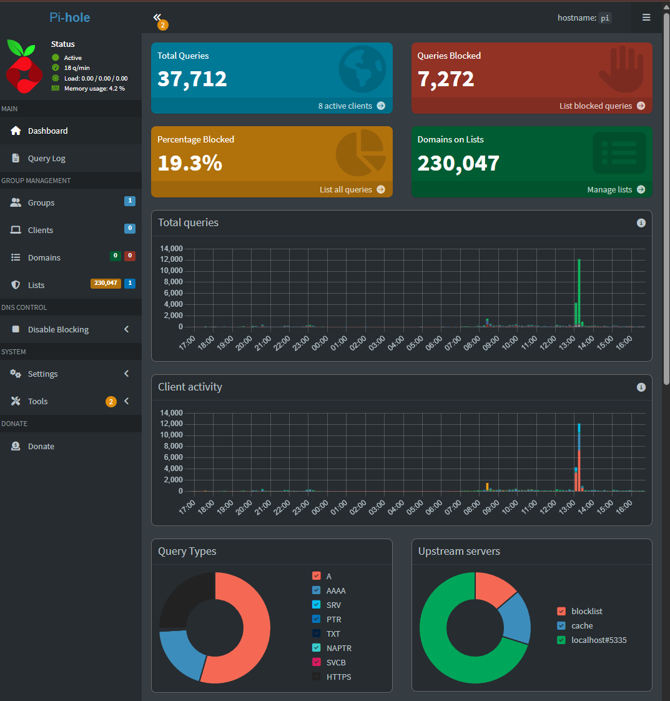

# Deploying Pi-hole  
## Summary
**First Started:** August 2025  

**End-Date:** Completed  

**Overview:**  
This project focused on deploying Pi-hole as a DNS sinkhole and DHCP server in my home lab. Pi-hole provides network-wide ad blocking, visibility into DNS queries, and the ability to capture logs for ingestion into Splunk. This setup acts as both a practical security control and a valuable data source for SOC-style monitoring.  

**Goal/Idea:** Deploy and configure Pi-hole to act as the central DNS service in my home lab.  
- Filter unwanted/malicious domains using blocklists  
- Capture detailed DNS query logs for analysis  
- Provide DHCP services for my lab network  
- Integrate with Splunk for visibility and detection engineering  

## Skills Learned
- DNS and DHCP fundamentals  
- Linux system administration  
- Pi-hole installation and configuration  
- Log validation and collection  
- Web UI management and troubleshooting  

## Outcome
A fully functional Pi-hole instance running on a Raspberry Pi:  
- Accessible via the web admin interface (`http://10.0.0.3/admin/login`)  
- Logging DNS queries to `/var/log/pihole.log`  
- Blocking malicious/ad domains at the network level  
 

This project created a reliable foundation for DNS-level visibility and detection in the SOC lab.  

## Progress Notes
- Imaged a pi with ubuntu server on it, no GUI for increase in performace capabilities
- Installed Pi-hole and verified service availability  
- Configured DHCP and static IP assignment  
- Validated DNS query logging locally  
