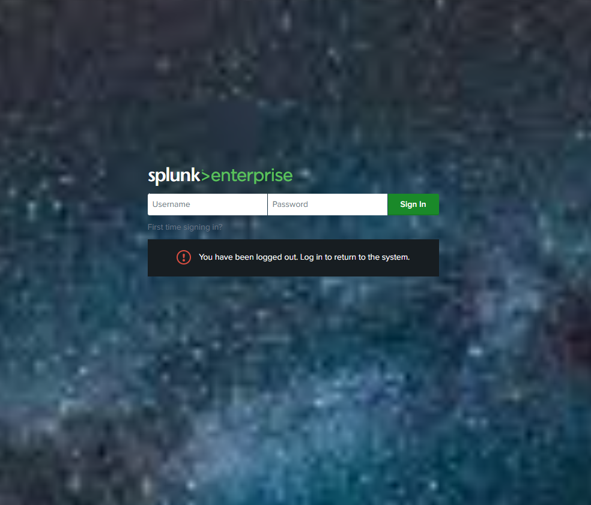
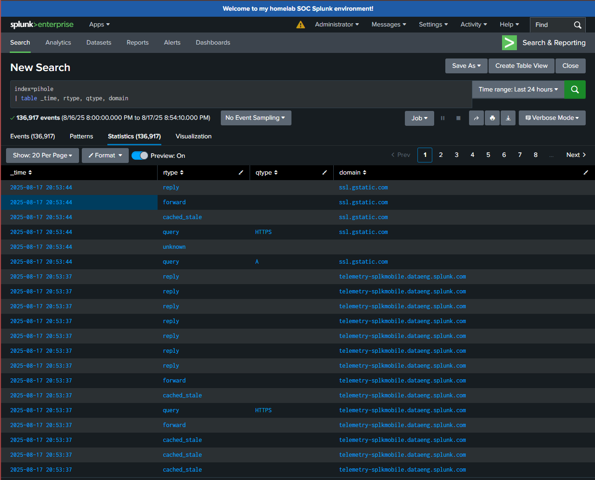

# Splunk Enterprise Setup  
## Summary
**First Started:** August 2025  

**End-Date:** Completed  

**Overview:**  
This project involved setting up Splunk Enterprise inside a VMware Workstation Pro virtual machine to serve as the SIEM in my at-home SOC. The Splunk server ingests logs from Pi-hole and provides search, dashboarding, and alerting capabilities.  

**Goal/Idea:** Deploy a functioning Splunk instance to act as the central log management and detection system in the lab.  
- Install and configure Splunk Enterprise in a Linux VM  
- Configure networking (NAT/Bridged) for log ingestion  
- Set up data inputs for Pi-hole DNS logs  
- Validate data ingestion and prepare for custom app/TA development  

## Skills Learned
- Virtual machine provisioning and networking (VMware Workstation Pro)  
- Linux system administration for Splunk services  
- Splunk Enterprise installation and configuration  
- Log ingestion pipeline design  
- Troubleshooting and validation using `btool` and Splunk SPL  

## Outcome
- Running Splunk Enterprise instance inside a VM at `/opt/splunk`  
- Successfully ingesting DNS logs from Pi-hole  
- Configured index/sourcetype mappings for clarity  
- Ready for use in dashboards, searches, and alerts  
- Provides the backbone for further SOC lab development  

## Progress Notes
- Provisioned Linux Server VM with 8GB of RAM and 50GB of disk space to start.  
- Installed Splunk Enterprise and verified startup on port `8000`  
- Configured Pi-hole log ingestion using a Univeral Forwarder on my pi  
- Validated data flow with test SPL queries  

## Screenshots
To make the project documentation more engaging, include the following screenshots:  

1. **Splunk Login Page** (I changed the original background lol)   

3. **Search Query Results** - Showing the ingested logs from pihole

